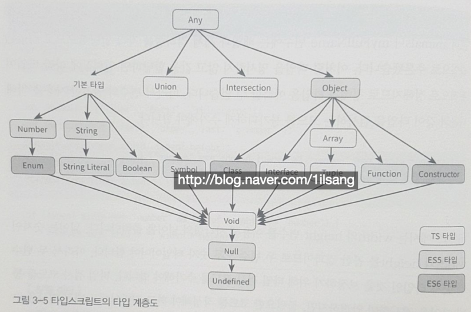

# Typescript Quick Start

## 03 _ 변수 선언과 기본 타입

### 3.1. 변수 선언

####  3.1.1. var 선언자 특징

- 호이스팅

```typescript
helloMessage = "hello";
console.log(helloMessage);

var helloMessage;
```

- 함수 레벨 스코프(function level scope)  <> 블록레벨 스코프(block level scope)

```typescript
var myName = "sad";

if(true){
    var myName = "happy";
}

console.log(myName); // "happy" 출력
```


블록 레벨 스코프를 지원하는 대표적인 선언

- let, const
- class, interface, type alias, enum


#### 3.1.2. let 선언자 특징

- 같은 블록 내에서 같은 이름의 변수를 중복해서 선언할 수 없음

```typescript
let myName2;
let myName2; // Error
```

- 변수를 초기화하기 전에는 변수에 접근할 수 없게 해서 호이스팅을 방지

```typescript
console.log(myName2); // Error, 변수를 초기화하기 전에 변수에 접근 불가
let myName2 = "happy";
```

- 선언할 변수에 블록레벨 스코프를 적용

```typescript
{ 
    // A scope
    { 
        // B scope
        { 
            // C scope
        }
    }
}
```


#### 3.1.3. 상수 선언

`const`

- 블록 레벨 스코프 지원
- 호이스팅 일으키지 않음
- 변수를 상수로 선언할 때 사용
- 선언할 때 초기화는 가능하지만 재할당 불가 (read only)


```typescript
const profile = {
    name:"happy",
    month: birthMonth
}

profile = {
    name: "happygrammer",
    month: 1
} // Error 재할당 불가

profile.name = "happy1"; // 할당 가능
profile.name = "happy2"; // 할당 가능
profile.month--; // 할당 가능
```

예외적으로 const로 선언한 변수라도 객체 리터럴의 속성으로는 변경할 수 있다.

값 자체를 재할당 하는 것은 허용하지 않지만, 속성값의 변경을 허용하는 특성


### 3.2. 타입 검사와 타입 선언

#### 3.2.1. 점진적 타입 검사

1. 정적 타입 검사(statically type checking) : 자바, C++
2. 동적 타입 검사(dynamically type checking) : 자바스크립트
3. 점진적 타입 검사(gradually type checking) : 타입스크립트, 파이썬


##### 점진적 타입 검사

- 컴파일 시간에 타입 검사를 수행하면서 필요에 따라 타입 선언의 생략을 허용
- 타입 선언을 생략하면 암시적(implicit) 형변환이 일어난다

```typescript
function add10(a){
    return a + 10;
}

add10(1);
// 매개변수 a에는 타입을 선언하지 않았지만 오류로 취급하지 않음
// 변환된 자바스크립트는 동적으로 타입이 결정되어 오류 없이 실행

```

##### 

##### 점진적 타이핑(gradual typing)

- 타입스크립트에서 점진적 타이핑을 설명할 때 적절한 타입으로 any가 있다.

- any 타입은 모든 타입의 최상위 타입이며, 동적 타입과 정적 타입의 경계선에 있는 타입으로 타입스크립트에서는 특별히 다뤄짐

- any 타입으로 선언된 변수는 어떤 타입의 변수도 받아들이면서 심지어 타입이 없는 변수도 받아들임


#### 3.2.2. 자바스크립트의 동적 타이핑

- 자바스크립트에서는 `기본 타입(primitive types)`과 `객체 타입(object types)`이 있습니다.

- 기본 타입은 Number, Boolean, String과 같은 타입을 말하고,

- 객체 타입으로는 객체 리터럴, 배열, 내장 객체가 있다

- 자바스크립트에는 타입이 있지만, 타입을 강제할 수는 없고 값을 할당할 때 타입이 추론된다.

```bash
변수에 할당할 때 타입이 정해짐 => 동적 타이핑(dynamic typing)
```


#### 3.2.3. 타입 계층도

점진적 타입 시스템을 지원하기에 암시적 형변환이나 여러 타입을 결합해 새로운 타입을 정의하는 것을 허용한다.



모든 타입을 받을 수 있는 any 타입이 가장 상위에 있고 그 아래로 다음의 타입이 있다

- 기본 타입
- 객체 타입
- 기타 타입(유니언 타입, 인터섹션 타입)

자바스크립트 타입과 비교했을 때 타입스크립트에는 다음과 같은 타입이 추가되었다

- 객체 타입의 상위 타입으로 any 추가
- any 타입의 특수 타입으로 유니언 타입과 인터섹션 타입 추가
- 객체(object) 타입의 하위 타입으로 Array, Interface, Tuple 추가
- void 타입 추가


##### 기본 타입(primitive types)

보편적으로 많이 사용되는 내장 타입

- string, number, boolean
- symbol(ECMA 2015에 추가됨)
- enum
- 문자열 리터럴

```typescript
Template literals

let myNickname: string = "happy"; // cf) 문자열 값은 큰따옴표를 이용할 것을 권장
let sentence: string = `my name is ${myNickname}`;
```

```typescript
ES6 제안으로 10진수뿐만 아니라 16진수, 2진수, 8진수도 지원

let decimal: number = 6;
let hex: number = 0xf00d;
let binary: number = 0b1010;
let octal: number = 0o744;
```

```typescript
symbol: 고유하고 수정 불가능한 데이터 타입으로 객체 속성의 식별자로 사용

let hello = Symbol();
```

```typescript
enum: number에서 확장된 타입 첫번째 Enum 요소에는 숫자 0 값이 할당
      그다음 값은 특별히 초기화하지 않는 이상 1씩 증가
      
enum WeekDay {Mon, Tue, Wed, Thu}
let day: WeekDay = WeekDay.Mon;

enum Color {
  RED = 10,
  GREEN = 20,
  BLUE = RED + GREEN
}

enum Color {
  RED = 'red',
  GREEN = 'green',
  BLUE = 'blue'
}
```

```typescript
문자열 리터럴 타입: string 타입의 확장 타입
    사용자 정의 타입에 정의한 문자열만 할당받을 수 있다

type EventType = "keyup" | "mouseover";
```


##### 객체 타입

객체 타입은 속성을 포함

호출 시그니처(call signature), 생성자 시그니처(construct signature) 등으로 구성된 타입

- Array
- Tuple
- Function
- 생성자
- Class
- Interface

```typescript
array: 배열 요소에 대응하는 타입

let items: number[] = [1,2,3];
```

```typescript
tuple: 배열 요소가 n개로 정해질 때 각 요소별로 타입을 지정한 타입

let x: [string, number];
x = ["tuple", 100];
```

```typescript
생성자 타입은 하나의 객체(클래스로부터 생성)가 여러 생성자의 시그니처로 구성될 때 포함할 수 있는 타입으로,
    생성자 타입 리터럴(constructor type literal)을 사용해 정의한다.
    
생성자 타입 리터럴은 생성자 시그니처를 구성하는 `타입 매개변수`,` 매개변수 목록`, `반환 타입`으로 구성되며, 다음과 같은 형식으로 선언한다.

[형식]
new <타입1, 타입2, ...> (매개변수1, 매개변수2, ...) => 타입
```

```typescript
class, interface: 객체 타입(object types)으로 분류되고, 객체지향 프로그래밍이나 구조 타이핑 등에 활용된다
```


##### 기타 타입

- 유니언(union)
- 인터섹션(intersection)
- 특수 타입

```typescript
union: 2개 이상의 타입을 하나의 타입으로 정의한 타입

var x: string | number;
```

```typescript
intersection: 두 타입을 합쳐 하나로 만들 수 있는 타입

interface Cat { leg: number; }
interface Bird { wing: number; }
let birdCat: Cat & Bird = { leg: 4, wing: 2 };
```

```typescript
특수타입: 타입 계층도의 가장 아래쪽에 위치한 void, null, nudefined
	함수에 반환값이 없을 때 void 타입을 선언할 수 있는데 undefined나 null 값을 받을 때 사용한다.
    
function say(): void{
    alert("hello");
}
let unusable: void = undefined;
// unusable 처럼 변수에 undefined나 null값을 할당하는 예는 흔치 않으므로 변수에 void 타입을 사용하는 것은 유용하지 않을 수 있습니다.
```

```typescript
null, undefined 타입은 다른 모든 타입의 하위 타입(subtype)
undefined는 어떠한 빈 값으로도 초기화되지 않는 타입

let a: undefined = undefined;
```

```typescript
빈 값으로도 초기화되지 않는 undefined와 달리 null 타입은 빈 객체로 초기화가 된다.

var person = {name: "happy"}; // person 변수에 객체 리터럴을 할당하고
person = null // null 로 초기화하면 person변수는 object 타입이 된다
```

```typescript
non-nullable: null이나 undefined를 허용하지 않는 타입
lookup: 인터페이스를 이용해 키값을 설정할 수 있는 타입
```


#### 3.2.4. 변수에 타입 지정

타입스크립트는 강력한 타입을 지원

명시적 타입 표기(explicit type annotation)를 하면 변수에 어떤 값이 할당 될지 직관적으로 알 수 있다.

```typescript
[형식]
var < 변수 식별자 > : < 타입 > = < 값 >;

var isTrue: boolean = true;
var width: number = 10;
var country: string = "korea";
```


